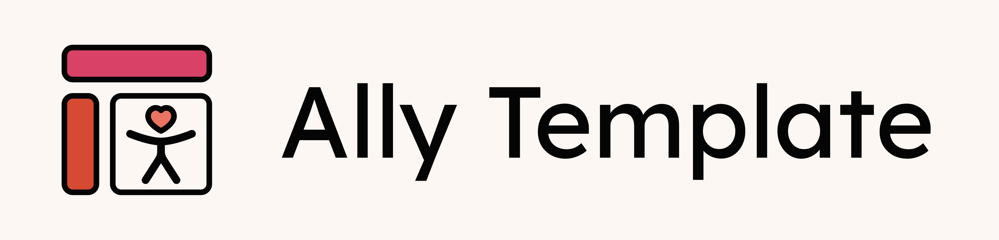
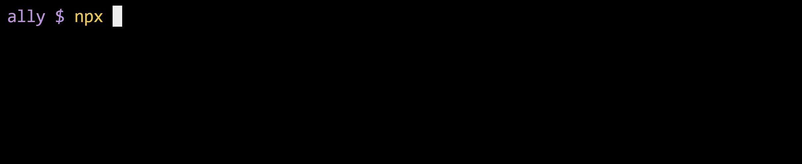
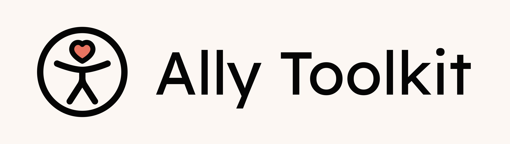

# Ally template

<picture>
  <source media="(prefers-color-scheme: dark)" srcset="assets/ally-template-banner-dark.png">
  <source media="(prefers-color-scheme: light)" srcset="assets/ally-template-banner-light.png">
  
</picture>

React + Vite template built with a focus on accessibility 🩷

## General Info

This project is built with:

- Vite
- React
- TypeScript
- React Router DOM

You don’t need to clone this template manually. You can scaffold a new project using an npx script:

```bash
npx create-ally-app
```



## Accessibility Features

This template comes with a full suite of accessibility (a11y) features to ensure your application meets WCAG standards and provides an inclusive user experience. It includes:

- **Scripts for accessibility testing** using [Axe](https://github.com/dequelabs/axe-core), [Pa11y](https://pa11y.org/) and [Lighthouse](https://github.com/GoogleChrome/lighthouse-ci), integrated with GitHub Actions
- **Static accessibility checks** via the `eslint-plugin-jsx-a11y` ESLint plugin
- **Example code** demonstrating accessible components, end-to-end accessibility testing, and color palettes with WCAG-compliant contrast ratios for both light and dark modes

### Scripts

```bash
# Run all accessibility tests
yarn a11y:all

# Run individual accessibility tests
yarn a11y:axe        # Test with Axe Core
yarn a11y:pa11y      # Test with Pa11y
yarn a11y:lighthouse # Test with Lighthouse CI

# Update Lighthouse config with current routes
yarn update-lighthouse-config
```

### GitHub Actions Integration

The repository includes automated accessibility testing in CI/CD:

- **Pull Request Comments** - Lighthouse CI posts performance and accessibility results directly to PRs
- **Multiple Tools** - Each PR is tested with Axe, Pa11y, and Lighthouse

### Local Development

Before pushing changes, you can run accessibility tests locally:

```bash
# Start your dev server
yarn start

# In another terminal, run accessibility tests
yarn a11y:all
```

## Common Scripts

```json
"scripts": {
  "build": "tsc -b && vite build",
  "preview": "vite preview",
  "format": "prettier --write .",
  "format:check": "prettier --check .",
  "lint": "eslint --max-warnings=0 .",
  "start": "vite --port 3000",
  "type-check": "tsc --noEmit"
}
```

### Development & Build

- `yarn start` - Starts the Vite dev server with hot module reload, runs on port 3000.
- `yarn build` - Runs the TypeScript compiler (`tsc -b`) and builds the project with Vite.

### Code Quality

- `yarn format` - Formats all files using Prettier.
- `yarn format:check` - Checks if files are formatted correctly (fails if not).
- `yarn lint` - Runs ESLint. Fails on any warning or error.
- `yarn type-check` - Checks TypeScript types without emitting any files.

# Quick Accessibility Reference

## Common Patterns

- `<button>` for actions, `<a>` for navigation
- Every form input needs a `<label>`
- Images need `alt` text (empty `alt=""` for decorative)
- Use headings in order (h1, h2, h3...)

## Quick Tests

- Tab through your page - does it make sense?
- Turn off CSS - is content still usable?
- Run `yarn lint` - fix any a11y warnings

---

<picture>

  <source media="(prefers-color-scheme: dark)" srcset="assets/ally-toolkit-banner-dark.png">
  <source media="(prefers-color-scheme: light)" srcset="assets/ally-toolkit-banner-light.png">
  
</picture>

Part of **Ally Toolkit** · _Built with a focus on accessibility 🩷_
